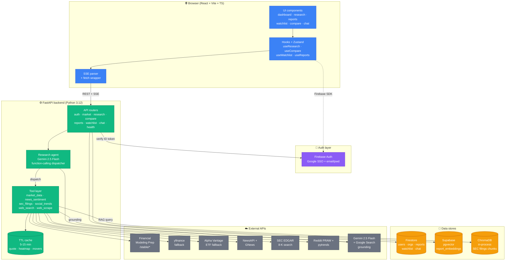
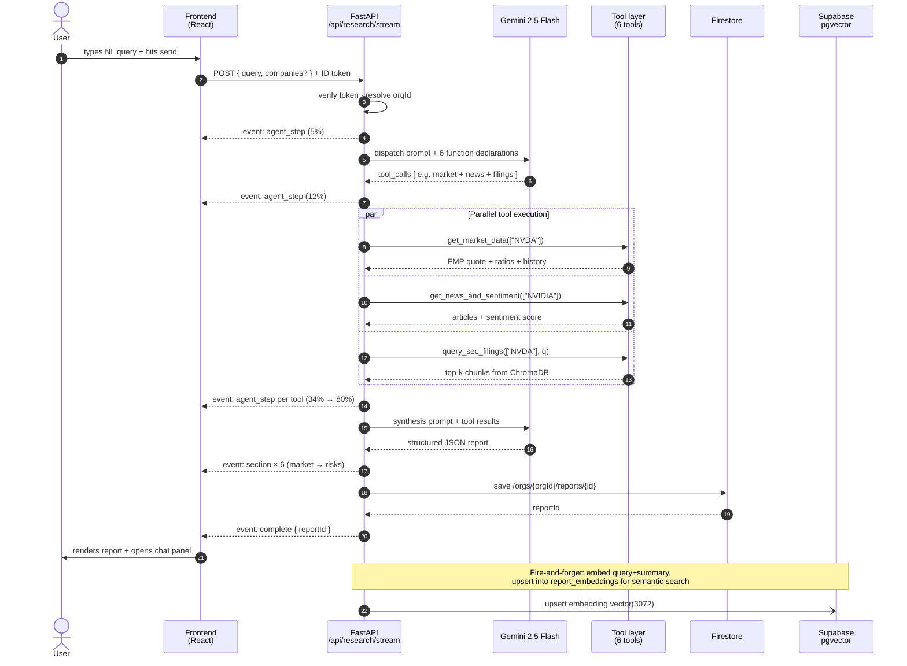

<div align="center">

# Klypup — Investment Research Intelligence Platform

**Natural-language investment research, powered by a multi-tool agent that streams structured, source-attributed analysis.**

[](https://www.python.org/)
[](https://fastapi.tiangolo.com/)
[](https://react.dev/)
[](https://www.typescriptlang.org/)
[](https://ai.google.dev/)
[](LICENSE)

</div>

---

Type a question like *"Analyze NVIDIA Q3 earnings vs AMD and the main competitive risks"* and Klypup orchestrates six data tools in parallel — market data, news sentiment, SEC filings RAG, social signals, web-grounded search, optional scraping — then streams a structured, cited research report to the browser in 20-45 seconds. Follow up in a chat panel that's grounded in the report.

---

## ✨ Features

- **Agentic research** — Gemini 2.5 Flash picks the right tools per query (no hardcoded pipeline) and synthesizes a structured JSON report.
- **Streaming UI** — sections animate in as each tool finishes; progress bar reflects real-time agent state via Server-Sent Events.
- **Grounded sources** — every claim carries `[Source: …]` attribution; news articles and SEC filings link out.
- **Chat follow-up** — ask "which is the better buy?" after a report; answers stream token-by-token and cite the report's own numbers.
- **Comparison mode** — 2-4 companies side by side: price charts, normalized 6-axis radar, sortable metrics, AI synthesis + investor-archetype matching.
- **Semantic report search** — Gemini embeddings + Supabase pgvector over saved reports; find research by meaning, not keywords.
- **Watchlist** — drag-reorder, live quotes, 7-day sparkline, sentiment chip per ticker.
- **Multi-tenant** — defense-in-depth: Firestore path rules + backend middleware + Supabase RLS. Each org's data is invisible to every other.
- **Voice I/O** — Web Speech API for dictating queries and reading reports aloud.
- **Graceful degradation** — every tool, every upstream provider has fallbacks. No single failure kills a research run.

---

## 🏗 Architecture



---

## 🔄 Data flow — a single research query



---

## 🧰 Tech stack

```mermaid
graph LR
    subgraph Frontend["Frontend"]
        direction TB
        F1[Vite + React 18]
        F2[TypeScript 5]
        F3[Tailwind v3<br/>dark mode]
        F4[React Router v6]
        F5[React Query v5]
        F6[Zustand]
        F7[Recharts + D3]
        F8[Framer Motion]
        F9[React Markdown]
    end

    subgraph Backend["Backend"]
        direction TB
        B1[FastAPI 0.115]
        B2[Uvicorn + SSE]
        B3[Pydantic v2]
        B4[httpx async]
        B5[Firebase Admin]
        B6[google-genai]
        B7[chromadb]
        B8[supabase-py]
        B9[TextBlob]
    end

    subgraph AI["AI / ML"]
        direction TB
        A1[Gemini 2.5 Flash<br/>function calling]
        A2[Google Search<br/>grounding]
        A3[gemini-embedding-001<br/>3072-dim]
        A4[tiktoken chunking]
    end

    subgraph Stores["Data layer"]
        direction TB
        D1[Firebase Auth]
        D2[Firestore<br/>NoSQL]
        D3[Supabase Postgres<br/>+ pgvector]
        D4[ChromaDB<br/>in-process]
    end

    subgraph Providers["External data"]
        direction TB
        P1[Financial Modeling Prep]
        P2[yfinance fallback]
        P3[Alpha Vantage]
        P4[NewsAPI + GNews]
        P5[SEC EDGAR]
        P6[Reddit PRAW]
        P7[pytrends]
    end

    Frontend --> Backend
    Backend --> AI
    Backend --> Stores
    Backend --> Providers

    classDef fe fill:#3B82F6,stroke:#1d4ed8,color:#fff
    classDef be fill:#10B981,stroke:#047857,color:#fff
    classDef ai fill:#8B5CF6,stroke:#6d28d9,color:#fff
    classDef ds fill:#F59E0B,stroke:#b45309,color:#fff
    classDef ex fill:#6B7280,stroke:#374151,color:#fff
    class F1,F2,F3,F4,F5,F6,F7,F8,F9 fe
    class B1,B2,B3,B4,B5,B6,B7,B8,B9 be
    class A1,A2,A3,A4 ai
    class D1,D2,D3,D4 ds
    class P1,P2,P3,P4,P5,P6,P7 ex
```



---

## 🚀 Quickstart (local)

**Prereqs:** Python 3.12, Node 20+, a Firebase project with Auth + Firestore enabled, and free-tier API keys from AI Studio (Gemini), Financial Modeling Prep, NewsAPI, GNews, Alpha Vantage, and optionally Supabase.

```bash
# 1. Clone + install
git clone https://github.com/Sujanraj0306/Klypup-Investment-Research-Intelligence-Platform.git
cd Klypup-Investment-Research-Intelligence-Platform

# 2. Backend
cd backend
python3.12 -m venv .venv && source .venv/bin/activate
pip install -r requirements.txt
cp .env.example .env              # fill in your keys
cp /path/to/firebase-admin.json ./firebase-admin.json

# 3. Frontend
cd ../frontend
npm install
cp .env.local.example .env.local  # fill in your keys

# 4. Supabase (optional, enables semantic report search)
#    Run migrations/supabase_init.sql in your Supabase SQL editor

# 5. Start everything
cd ../backend && .venv/bin/uvicorn main:app --reload
#    ...in another shell:
cd ../frontend && npm run dev

# → open http://localhost:5173
```

Ingest SEC filings so the filings section isn't empty:

```bash
cd backend
.venv/bin/python scripts/ingest_filings.py --ticker NVDA --form 10-K
.venv/bin/python scripts/ingest_filings.py --ticker AMD --form 10-K
```

---

## 📡 API surface

All endpoints are under `/api` and require a `Authorization: Bearer <firebase-id-token>` header except `/api/health`.

| Method | Endpoint | Purpose |
|---|---|---|
| `GET` | `/api/health` | Unauthed liveness probe |
| `GET` | `/api/market/quote/{symbol}` | Single quote with cascade fallback |
| `GET` | `/api/market/history/{symbol}` | OHLCV history |
| `GET` | `/api/market/sector-heatmap` | 11 SPDR sector ETFs, % change |
| `GET` | `/api/market/movers` | Top 5 gainers + losers |
| `GET` | `/api/market/multi-quote?symbols=…` | Batch quotes (≤10) |
| `POST` | `/api/research/stream` | SSE — streams a research report |
| `POST` | `/api/compare/stream` | SSE — 2-4 company comparison |
| `POST` | `/api/chat/followup` | SSE — follow-up chat on a saved report |
| `GET` / `POST` / `PATCH` / `DELETE` | `/api/reports[/{id}]` | CRUD + semantic search |
| `GET` / `POST` / `PATCH` / `DELETE` | `/api/watchlist[/{symbol}]` | Watchlist CRUD + reorder |

OpenAPI docs at `http://localhost:8000/docs` once the backend is up.

---

## 🗂 Repository layout

```
klypup/
├── frontend/                  Vite + React + TS
│   ├── src/
│   │   ├── components/        auth / layout / dashboard / research
│   │   │                      report / watchlist / reports / compare / ui
│   │   ├── hooks/             useAuth · useResearch (SSE) · useCompare · ...
│   │   ├── lib/               api (SSE parser) · firebase · supabase · format
│   │   └── types/             TypeScript interfaces
│   └── .env.local.example
├── backend/                   FastAPI + Python 3.12
│   ├── main.py                App entry; logging + telemetry config
│   ├── app/
│   │   ├── api/               auth · market · research · compare · reports
│   │   │                      watchlist · chat · health
│   │   ├── agent/             research_agent.py · tools.py (6 tools)
│   │   ├── core/              config · cache · market cascade · embeddings
│   │   │                      firebase_admin · firestore · supabase
│   │   └── services/          rag_service (ChromaDB)
│   ├── scripts/
│   │   └── ingest_filings.py  SEC filing → chunk → embed → ChromaDB
│   └── .env.example
├── migrations/
│   └── supabase_init.sql      pgvector + report_embeddings + match_reports
├── docs/
│   ├── SUPABASE_SETUP.md      5-minute Supabase walkthrough
│   └── DEPLOY_FREE.md         Render + Firebase free-tier deploy
├── ARCHITECTURE.md            Full component + sequence docs
├── DECISIONS.md               ADRs (9 decisions + why)
└── README.md                  you are here
```

---

## 🔐 Security & multi-tenancy

Three independent checks; any one failing still prevents a data leak:

1. **Firestore rules** ([firestore.rules](firestore.rules)) scope every read/write under `/orgs/{orgId}/**` to `request.auth.uid` matching the org.
2. **Backend middleware** ([backend/app/api/auth.py](backend/app/api/auth.py)) verifies the Firebase ID token, resolves `orgId`, and injects it via `CurrentOrgUser` — no route reads `orgId` from the request body.
3. **Supabase Row Level Security** — `report_embeddings` is readable/writable only by the service role. Even if an attacker grabs the anon key, they see zero rows.

---

## 🧪 Testing the pipeline

From `backend/`:

```bash
# Live end-to-end test of the agent
.venv/bin/python -c "
import asyncio
from app.agent.research_agent import run_research
async def main():
    async for ev in run_research('Analyze Apple Q3 earnings', ['AAPL']):
        if ev['type'] == 'agent_step': print(f\"[{ev['progress']:3}%] {ev['step']}\")
        elif ev['type'] == 'section':  print(f'  → section: {ev[\"section\"]}')
        elif ev['type'] == 'final':    print(f'  ✓ tools: {ev[\"tools_used\"]}')
asyncio.run(main())
"
```

Expected: 6 streaming sections (`market`, `news`, `filings`, `social`, `synthesis`, `risks`), complete in 20-45s.

---

## 📚 Documentation

| Doc | Read when |
|---|---|
| [ARCHITECTURE.md](ARCHITECTURE.md) | You want sequence diagrams, folder-by-folder walkthrough, caching strategy, streaming protocol |
| [DECISIONS.md](DECISIONS.md) | You want the *why* behind every architectural choice (9 ADRs) |
| [docs/SUPABASE_SETUP.md](docs/SUPABASE_SETUP.md) | You're wiring up pgvector for the first time |
| [docs/DEPLOY_FREE.md](docs/DEPLOY_FREE.md) | You want to deploy on Render + Firebase free tier (≈25 min, $0/mo) |
| [migrations/supabase_init.sql](migrations/supabase_init.sql) | One-click SQL to initialize the vector store |

---

## 📄 License

MIT © 2026 Sujan Raj
